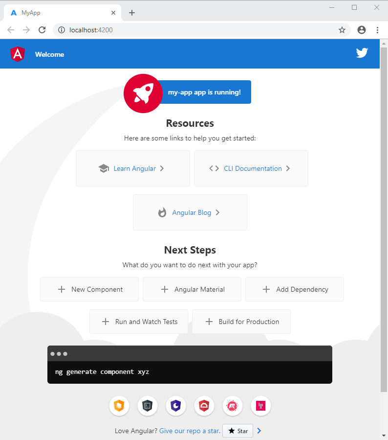

# Configuração de pagina web Utilizando Angular

## Primeiros passos

### Ambiente de Desenvolvimento:

A escolha do ambiente de desenvolvimento é de exclusiva escolha do usuario, neste tutorial, utilizarei o[ **Visual Studio Code**](https://code.visualstudio.com/) com alguns snippets para me auxiliar a desenvolver os modulos do projeto.

### Alguns snippets, ferramentas e linguagens:

Logo no inicio da pagina do Visual Studio Code, voce tem a opção de adicionar algumas ferramentas para te auxiliar no desenvolvimento dos seus projetos. Uma dessas ferramentas é o suporte ao javascript, eu recomendo que instale esse suporte para facilitar a programação no decorrer do trabalho.

Basta clicar sobre o nome da linguagem desejada\( nesse caso o javascript\) e o visual fara o resto.

Na aba de extensões\( no canto esquerdo da pagina do visual studio code\), clique no campo de busca e digite - **ESLint**- esse facilitador verifica a documentação durante o desenvolvimento, e isso facilita muito, acredite.

Outra ferramenta é o -**Angular Snippets\(version 9\)**- é uma extenção para visual studio code que adiciona snippets para angular do typescript\(transpilador javascript da microsoft\) e html.

Outra ferramenta muito importante é o -**NPM**- essa extensão serve para gerenciar as funcionalidades providas pelas bibliotecas que estao disponiveis no **npm packages**, para baixar e instalar esses pacotes, devemos ter esse gerenciador instalado como extensão de nossa plataforma de desenvolvimento.


 Todas as extensões basicas necessarias estao descritas a cima, basta colocar na aba de extensões os nomes escritos em negrito e em seguida clicar em **install** que a extensão sera baixada e instalada dentro do Visual Studio Code.



Antes de começarmos o desenvolvimento do projeto, é importante que voce ja tenha instalado o [**NODE.JS**](https://nodejs.org/en/) em sua maquina.


## Passo 1: Instalando o Angular CLI

Voce usa o Angular CLI para cirar projetos, gerar aplicações e bibliotecas, a performance ira variar a depender dos requisitos do seu projeto, em nosso caso, criaremos uma pagina HELLO WORLD simples, que nao incluira testes ou guarda de rotas e autenticaçao.

instala o angular globalmente.

Para instalar o CLI usando npm, abra o terminal/console e entre com o comando abaixo:

```text
npm install -g @angular/cli
```

> Esse comando usa o gerenciador de pacotes para gerar o angular/cli do workflow do seu projeto, o comando tambem pode ser escrito como:
>
> npm install -generate @angular/cli

## Passo 2: Criar o Workspace e Iniciar a aplicação

Desenvolveremos a aplicação no contexto do angular, para criar um novo Workspace e iniciar o app:

1. Usar o comando CLI `ng new` e em seguida colocar o nome do app:

```text
ng new hello-world
```

   2. O comando `ng new` ira perguntar dentro do prompt de comando\(**terminal**\) quais congifurações voce deseja inicialmente para seu projeto, se nao quiser ou souber quais escolher, apenas deixe as pre definidas como _default_ e coloque _yes_ em tudo.

O angular CLI ira instalar o necessario extraido dos pacotes angular npm e outras dependencias. Isso podera levar algum tempo, a depender de sua conecxao com internet.

Logo de inicio o angular ira criar uma pagina simples de welcome e pronta para rodar.

## Passo 3: Rodar a aplicação

O **Angular CLI** inclue dentro de seus ecossistema um servidor, entao podemos facilmente construir e servir nosso projeto localmente.

1.  Voce deve estar dentro da pasta da aplicação\(atraves do terrminal do visual studio code\).
2. Inicie o servidor usando o comando CLI `ng serve`,  com o parametro `--open .`

```text
cd hello-world
ng serve --open
```

O comando ng serve inicia o servidor, verifica seus arquivos e reconstroi a aplicação com as mudanças que foram feitas, em nosso caso, ainda nao fizemos as modificações, mas é legar ver o projeto inicial funcionando.

O parametro `--open`\(ou apenas `-o`\) é uma opçao que serve para abrir automaticamente o seu _browser_ definido como _default_ no **visual studio code** do nosso projeto no endereço _http://localhost:4200/_.

Voçe deve ver algo como:



## Nosso Hello World

Para modificarmos nosso projeto e criarmos nossa pagina com a famosa frase inicial, iremos na arvore do projeto &gt; src &gt; app &gt; app.component.html

Nesse arquivo estao contidas toda a estrutura que vem por padrao nesse projeto inicial, iremos deletar tudo que estiver dentro do arquivo, e em seguida escrever codigos de pagina html normal.


Um dos snippets que instalamos no inicio do projeto, nos permite escrever tags html com maior facilidade, tente escrever de forma em cascata.

`html>head>title` dessa forma, sera gerado uma estrutura assim:

`<hmtl><head><title></title></head></html>`


E dentro do nosso `body` da pagina html coloque uma tag `h1` e escreva **HELLO WORLD.**

apos isso basta salvar\(ou apertar _Ctrl + s_\) e o hotdeploy do nosso servidor local ira atualizar a pagina carregando nossa nova informação.


Para finalizar o servidor, clique no terminal e pressione _Ctrl + c_, dessa forma o servidor ira finalizar a aplicação.


## Conclusão

Agora terminamos de instalar e rodar um primeiro projeto, ainda existem muitas outras funcionalidades que podem ser usadas dentro desse enorme ecossitema chamado Angular.

Caso queira se aprofundar mais nesse assunto, sugiro que siga a documentação oficial disponivel do [**Angular**](https://angular.io/docs)**,** o site segue uma estrutura em arvore que é de facil localização e sera necessario um pouco de conhecimento em ingles para entender oque estiver escrito.

## Autor <a id="autor"></a>

* ​[Linkedin](https://www.linkedin.com/in/silvio-antonio-de-oliveira-junior-621813142/)​
* ​[Github](https://github.com/silvioantonio)​
* ​[website](http://silvioantonio.ml/)​

> Compartilhar conhecimento é a melhor forma de aprender
>
> -OLIVEIRA, Silvio Antonio Junior.

